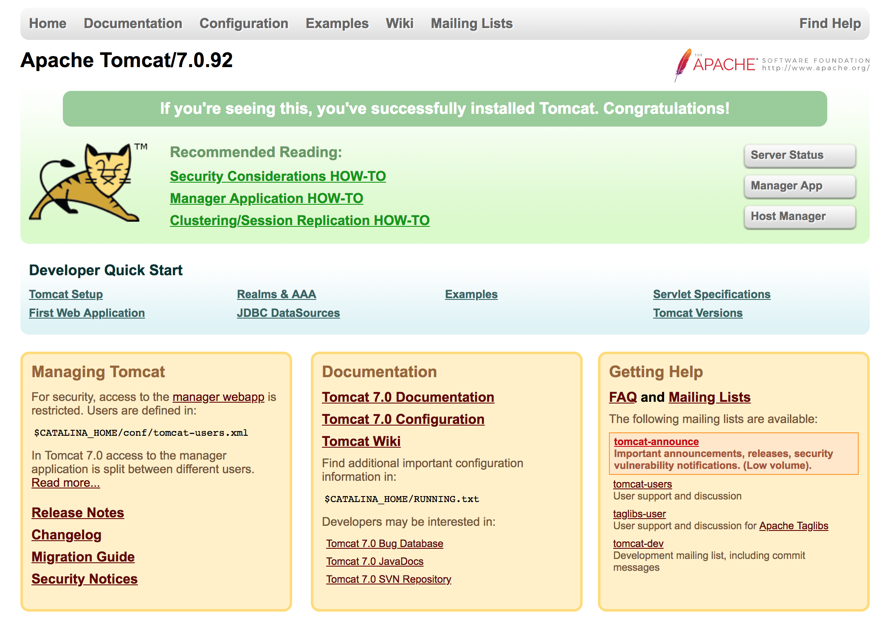

# Tomcat webserver container to run on Docker

Follow these steps to build Tomcat 7 servlet engine running in a container with remote debugging enabled, and run the Manager GUI.

## Build Sample web app

1.  Build the image from the `Dockerfile` in this directory, and tag it with the name `tomcatondocker`:

		docker image build -t tomcatondocker .

1.  Confirm the image was built:

		docker image ls

	You should see something like this:
	
	```
REPOSITORY          TAG                 IMAGE ID            CREATED             SIZE
tomcatondocker      latest              f66887ca5169        12 seconds ago      464MB
tomcat              7-jre8              2f92e08259d6        2 days ago          463MB
```

	Docker pulled the `tomcat` image and then made ours from it according to the steps in the `Dockerfile`.
	
1. Run the container like this:
		
		docker container run -p 8080:8080 -d tomcatondocker
	
	Notice a few things:
	* We use the `-p` flag to map port 8080 on our host machine to port 8080 in the container.  	* We use th `-d` flag to run in "detached" mode (i.e. in the background).

1.  Confirm the container is running:

		docker ps -f "ancestor=tomcatondocker"
		
	You should see `tomcatondocker` listed.

1.  Now, we can open the URL http://localhost:8080 from our browser.  You should see something like this:

	
	Yay!  We have deployed our Tomcat container.  Click the "Manager App" or "Host Manager" buttons to open those tools, the username/password is system/manager.  (They are configured in the `tomcat-users.xml` file.)

1. Let's extract the container id because that is needed to connect directly to it.  Set this variable in your shell for use later on:

		container_id=$(docker ps -f "ancestor=tomcatondocker" -q)
		
1.  Now, let's log into to our instance:

		docker exec -t -i ${container_id} bash -c 'echo $CATALINA_HOME'

		
	Check to see that the CATALINA_HOME variable was set for us:
	
		/usr/local/tomcat

	Type `exit` to return to your local machine.

1.	To shut down and remove the container, type these commands:

		docker container stop ${container_id}
		docker container rm ${container_id} 


